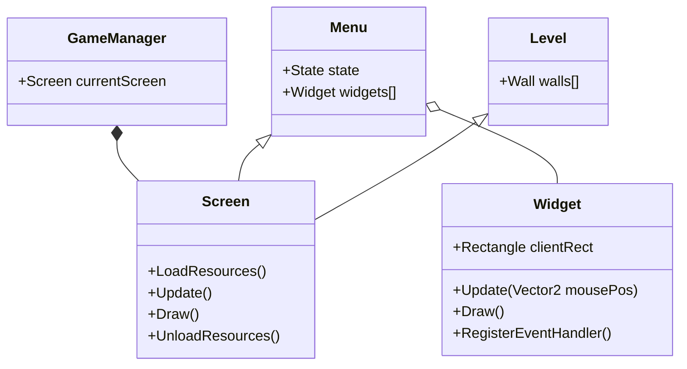

```mermaid
classDiagram
	GameManager *-- Screen
	GameManager : +Screen currentScreen
	Menu <|-- Screen
	Menu o-- Widget
	Level <|-- Screen
class Screen {
	+LoadResources()
	+Update()
	+Draw()
	+UnloadResources()
}
class Menu {
	+State state
	+Widget widgets[]
}
class Level {
	+Wall walls[]
}
class Widget {
	+Rectangle clientRect
	+Update(Vector2 mousePos)
	+Draw()
	+RegisterEventHandler()
}
```

## Widgets Class Diagram
